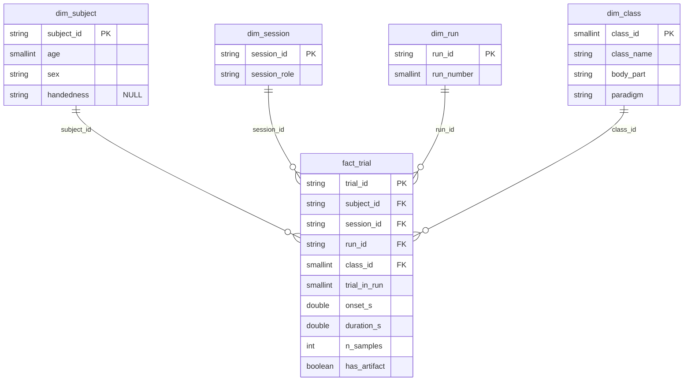

# BCI Competition IV 2a — ficha técnica e EDA

Dataset da tese (**decodificação da intenção de movimento**): imagética motora de 4 classes
em sujeitos saudáveis, carregado em formato pronto para ML via
[MOABB](https://moabb.neurotechx.com/) / [braindecode](https://braindecode.org/).

> A entrega anterior baseada no eegmmidb (EDF) foi arquivada em
> [`archive_aula01/aula01_eegmmidb/`](archive_aula01/aula01_eegmmidb/). Este repositório passou a ser
> exclusivamente sobre o BCI IV 2a.

## Reprodução

```powershell
uv sync --locked                                                # cria .venv a partir do uv.lock

uv run python -m src.ingest                                     # (re)gera data/processed/*.parquet
uv run jupyter notebook notebooks\01_eda_bci_iv_2a.ipynb        # EDA do 2a
uv run jupyter notebook notebooks\02_camada_analitica_2a.ipynb  # Parquet + DuckDB
uv run jupyter notebook notebooks\03_qualidade_2a.ipynb         # métricas de qualidade
uv run dbt build --project-dir dbt --profiles-dir dbt            # testes declarativos + camada Ouro
```

O Parquet já vem versionado em `data/processed/`, então os **notebooks 02 e 03 rodam offline**.
`src.ingest` e o **notebook 01** baixam o 2a via MOABB na 1ª vez (requer internet).
Detalhes: ambiente (seção 9), dados (seção 10), esquema estrela (seção 11), qualidade (seção 12).

## 1. Nome e fonte

**BCI Competition IV — dataset 2a** ("Graz data set A"), identificador
[`001-2014`](http://bnci-horizon-2020.eu/database/data-sets) no BNCI Horizon 2020 e
[`BNCI2014_001`](https://moabb.neurotechx.com/docs/generated/moabb.datasets.BNCI2014_001.html)
no MOABB. Coletado no Institute of Neural Engineering (Laboratory of Brain-Computer
Interfaces), TU Graz.

- Descrição original: Brunner, Leeb, Müller-Putz, Schlögl & Pfurtscheller (2008).
- Citação recomendada: Tangermann et al. (2012), *Review of the BCI Competition IV*,
  Frontiers in Neuroscience — DOI [10.3389/fnins.2012.00055](https://doi.org/10.3389/fnins.2012.00055).
- Fonte original da competição: <http://www.bbci.de/competition/iv/>

## 2. Licença

**Creative Commons Attribution-NoDerivatives 4.0 (CC BY-ND 4.0)** (conforme BNCI Horizon /
MOABB). Permite uso e redistribuição **do dataset original** com atribuição, mas a cláusula
**ND (NoDerivatives)** proíbe distribuir versões modificadas/derivadas dos dados.

> **Implicação prática:** não se deve versionar neste repositório uma versão processada
> (filtrada, epocada, convertida) do 2a — isso seria um derivado. Por isso os dados **não
> ficam no Git**; são baixados pelo MOABB no ambiente de cada pessoa (ver seção 10). Treinar
> modelos e publicar resultados/figuras derivados da análise não é afetado.

## 3. Variáveis principais

| Variável | Tipo | Formato / unidade | Faixa |
|---|---|---|---|
| Sinal EEG | contínuo | GDF (BioSig); `float64` em Volts no MNE | ±100 µV (sensibilidade do amplificador) |
| Canais EEG | categórico | 22 eletrodos (subconjunto 10-20) | `Fz`, `C3`, `Cz`, `C4`, … |
| Canais EOG | categórico | 3 eletrodos monopolares (controle de artefato) | `EOG-left/central/right` |
| Frequência de amostragem | constante | Hz | 250 Hz |
| Filtragem (aquisição) | — | passa-banda + notch | 0,5–100 Hz; notch 50 Hz |
| Classes | categórico | rótulo do trial | mão esquerda, mão direita, pés, língua |
| Sessão | identificador | treino (`T`) / avaliação (`E`) | 2 por sujeito, dias diferentes |
| Sujeito | identificador | `A01`–`A09` | 9 valores |

Estrutura de cada sessão: **6 runs × 48 trials (12 por classe) = 288 trials**.

Paradigma temporal do trial: cruz de fixação + bipe em `t=0`; seta de indicação (cue) em
`t=2 s` por 1,25 s; **imagética motora de `t≈2 s` até `t=6 s`** (~4 s de janela); pausa curta.

## 4. Tamanho

- 9 sujeitos × 2 sessões × 288 trials = **5.184 trials** rotulados.
- 4 classes balanceadas por desenho (72 trials por classe por sessão).
- Formato **GDF** (também disponível em `.mat` no BNCI). Os rótulos da sessão de avaliação,
  retidos durante a competição, hoje são públicos.

Amostra usada na EDA: 3 sujeitos (ver [`notebooks/01_eda_bci_iv_2a.ipynb`](notebooks/01_eda_bci_iv_2a.ipynb)).

## 5. Riscos de privacidade

Desidentificado (sujeitos `A01`–`A09`; a fonte traz só idade e sexo). Não há identificadores
diretos. O risco residual é o **EEG fingerprinting** — padrões espectrais individuais são
estáveis o bastante para reidentificação entre gravações —, mas exigiria que o atacante já
tivesse um EEG rotulado do mesmo indivíduo, então o risco acadêmico é baixo. Ainda assim, o
sinal bruto não deve ser tratado como anônimo em pipelines que o combinem com outras fontes.

## 6. Uso clínico e ML

**Aplicação.** BCI de imagética motora para reabilitação e comunicação assistiva em pessoas
com deficiência motora severa (AVC, ELA, lesão medular). É o benchmark mais usado da área.

**Pergunta de pesquisa.** É possível decodificar a intenção de movimento a partir do EEG —
qual dos 4 movimentos a pessoa está imaginando — sem movimento executado?

**Entradas.** Épocas de `22 canais × tempo` (~4 s a 250 Hz ≈ 1.000 amostras por canal), com
foco nos canais motores C3/Cz/C4 e nas bandas mu (8–12 Hz) e beta (13–30 Hz).

**Alvo.** A classe do trial: mão esquerda, mão direita, pés ou língua (4 classes).

**Métodos já relatados.** CSP + LDA (baseline clássico), classificadores Riemannianos
(covariância / tangent space) e CNNs para EEG (EEGNet, ShallowConvNet, Deep4Net) — todos
disponíveis no [braindecode](https://braindecode.org/). Protocolo padrão: **within-subject**
(treina na sessão `T`, testa na `E`); estudos modernos também exploram **cross-subject**.

## 7. Avaliação FAIR

| Princípio | Nota (1–5) | Justificativa |
|---|:---:|---|
| Findable | 5 | DOI [10.3389/fnins.2012.00055](https://doi.org/10.3389/fnins.2012.00055), id persistente `001-2014` no BNCI Horizon e indexação no MOABB como [`BNCI2014_001`](https://moabb.neurotechx.com/docs/generated/moabb.datasets.BNCI2014_001.html) — localizável por ferramenta, não só por busca textual. |
| Accessible | 5 | Download aberto por HTTPS no BNCI/TU Graz, sem login nem DUA, e carga em uma linha via MOABB. Metadados descritos na página do dataset. |
| Interoperable | 4 | GDF é formato aberto de eletrofisiologia (BioSig), lido por MNE/MOABB sem conversão. Perde 1 ponto por não seguir [BIDS-EEG](https://bids-specification.readthedocs.io/) e por não trazer coordenadas de eletrodo padronizadas (a montagem depende de template externo). |
| Reusable | 3 | Proveniência bem documentada (TU Graz, protocolo detalhado) e licença explícita, **mas a cláusula ND da CC BY-ND 4.0 restringe a redistribuição de versões derivadas** dos dados — limitação real de reúso. Some-se a demografia mínima (só idade e sexo, sem lateralidade). |

**Média: 4,25 / 5.** As perdas se concentram em *interoperability* (pré-BIDS) e
*reusability* (licença ND e demografia mínima).

## 8. Limitações conhecidas

### Específicas deste conjunto

- **Apenas 9 sujeitos.** Poucos sujeitos limitam estudos de generalização cross-subject e
  pré-treino — em compensação, há ~576 trials por sujeito, favorecendo o protocolo
  within-subject.
- **Licença CC BY-ND 4.0.** A cláusula NoDerivatives impede publicar/redistribuir uma versão
  processada dos dados (por isso o repo não versiona os dados).
- **Artefatos de EOG.** Há 3 canais de EOG justamente porque o piscar/movimento ocular
  contamina o EEG frontal; a remoção de artefato é parte esperada do pipeline. A fonte marca
  9,4% dos trials como artefato (seção 12).
- **Demografia mínima** (só idade e sexo; sem lateralidade) — a lateralidade condiciona a
  assimetria esperada em tarefas motoras e não pode ser controlada.
- **Apenas 2 sessões** por sujeito (treino/avaliação), o que limita a análise de estabilidade
  entre múltiplos dias.

### Inerentes ao gênero, não a este conjunto

- Apenas voluntários saudáveis, sem pacientes da população-alvo (AVC, ELA, lesão medular).
  Desempenho aqui não demonstra generalização clínica.
- Trials curtos (~4 s) em ambiente laboratorial controlado, o que tende a superestimar a
  acurácia frente ao uso real, com ruído, movimento e fadiga.

## 9. Ambiente reprodutível

Python 3.12, com as dependências diretas **fixadas** em [`pyproject.toml`](pyproject.toml) e as
transitivas em [`uv.lock`](uv.lock): `mne`, `numpy`, `pandas`, `matplotlib`, `notebook`; para o
2a, `moabb`, `braindecode` e `torch`; para a camada analítica, `duckdb` e `pyarrow`; e para os
testes declarativos, `dbt-duckdb`.
Instalação com `uv sync --locked` (bloco **Reprodução**, topo).

## 10. Dados

Os dados **não são versionados** neste repositório (a licença CC BY-ND desaconselha
redistribuir derivados, e o volume é grande). O MOABB baixa o dataset (na versão `.mat` do
BNCI, não o GDF original) para o cache local `~/mne_data` na primeira execução dos notebooks —
requer internet:

```python
from braindecode.datasets import MOABBDataset
MOABBDataset(dataset_name="BNCI2014_001", subject_ids=[1])  # baixa e carrega
```

O **sinal bruto** fica apenas no cache. O que é versionado (seção 11) é somente a tabela de
**metadados** de trial — rótulos, tempos, identificadores e idade/sexo dos sujeitos, sem
qualquer amostra de EEG.

## 11. Camada analítica (esquema estrela)

A partir dos **metadados** do 2a (sem o sinal bruto) é construída uma camada analítica em
**Parquet**, consultável com **DuckDB**. Ingestão em [`src/ingest.py`](src/ingest.py), **em
lotes** (um sujeito por vez, um row group por sujeito na fato); consultas e benchmark em
[`notebooks/02_camada_analitica_2a.ipynb`](notebooks/02_camada_analitica_2a.ipynb).



**Grão da tabela fato `fact_trial`: uma linha = um trial de imagética motora**
(5.184 = 9 sujeitos × 2 sessões × 288). Tipos explícitos, identificadores como texto:

| coluna | tipo | descrição |
|---|---|---|
| `trial_id` | TEXT (PK) | chave natural, ex. `A04_0train_run_1_t33` |
| `subject_id` | TEXT (FK) | → `dim_subject` |
| `session_id` | TEXT (FK) | → `dim_session` |
| `run_id` | TEXT (FK) | → `dim_run` |
| `class_id` | SMALLINT (FK) | → `dim_class` |
| `trial_in_run` | SMALLINT | índice do trial no run (0–47) |
| `onset_s` | DOUBLE | início da imagética (cue) na gravação |
| `duration_s` | DOUBLE | janela de imagética (4,0 s) |
| `n_samples` | INTEGER | amostras da época (1.000) |
| `has_artifact` | BOOLEAN | trial marcado como artefato na fonte |

**Dimensões:**

| dimensão | chave | atributos |
|---|---|---|
| `dim_subject` (paciente) | `subject_id` | `age`, `sex`; `handedness` **NULL** (não está na fonte) |
| `dim_class` (rótulo) | `class_id` | `class_name`, `body_part`, `paradigm` |
| `dim_session` (tempo) | `session_id` | `session_role` (train/test) |
| `dim_run` | `run_id` | `run_number` |

**Nulos verdadeiros:** a lateralidade, ausente na fonte, é `NULL` — nunca sentinela como
`-1`/`999`.

**Normalização/desnormalização:**

- Estrela, não floco de neve: `body_part` e `paradigm` ficam em `dim_class` e `session_role` em
  `dim_session`, sem subdimensões. São 4 e 2 linhas; a redundância é irrelevante e poupa joins.
- Chaves naturais em texto (`A01`, `0train`, `run_0`) em vez de surrogate keys: a fonte é fechada
  e as chaves são estáveis e legíveis.
- `trial_in_run` e `has_artifact` ficam na fato (dimensões degeneradas): não têm atributos próprios.
- `duration_s` e `n_samples` são constantes, mas ficam na fato: são medidas do grão e a taxa de
  amostragem (250 Hz) sai delas, sem coluna própria.
- `dim_session` e `dim_run` são papéis compartilhados pelos 9 sujeitos (2 e 6 linhas), não uma
  linha por gravação. Atributos que variam por sujeito × sessão (como a data) não cabem nelas.

**Fora do Parquet:** o **sinal EEG bruto** (22 canais × 1.000 amostras por trial), as gravações
contínuas e os arquivos GDF. Só metadados de trial + rótulos entram. *Modalidade* é constante
(EEG) — dimensão degenerada, não modelada; viraria tabela se entrassem MEG/EOG/áudio.

**CSV vs Parquet** (mesma `fact_trial`): o Parquet ficou **~6× menor** (54,1 vs 329,8 KiB) e a
agregação **~20× mais rápida** no DuckDB (tempo varia entre execuções). Os 9 row groups dos lotes
custam ~15 KiB frente a um único.

## 12. Qualidade dos dados

Métricas em [`notebooks/03_qualidade_2a.ipynb`](notebooks/03_qualidade_2a.ipynb), em SQL/DuckDB
sobre o Parquet.

| métrica | resultado |
|---|---|
| Duplicatas (PK das 5 tabelas e 2 chaves naturais da fato) | 0 |
| Completude da fato (10 campos) | 100% |
| Completude das dimensões | 100%, exceto `handedness` (0%) |
| Valores inválidos (18 regras: domínio, formato, FKs, contagens por run, ordem e intervalo dos trials, sentinelas) | 0 violações |
| Trials marcados como artefato na fonte | 488 de 5.184 (9,4%) |

**Inconsistências e decisões:**

| achado | decisão |
|---|---|
| `age` e `sex` estavam `NULL`, mas o `.mat` traz os dois | **Corrigido**: a ingestão passou a lê-los (9/9 sujeitos). |
| A fonte marca trials com artefato e a ingestão descartava a marcação | **Quarentena**: os 488 trials ficam na fato com `has_artifact = TRUE`; as análises filtram por essa coluna. |
| README descrevia `onset_s` como início do trial; é o início da imagética (cue, 2 s depois) | **Corrigido** na documentação. |
| `handedness` 0% completo | **Mantido com ressalva**: não está no `.mat`; segue `NULL`. |
| `recording_day` 0% completo e na dimensão errada (a data varia por sujeito × sessão; `dim_session` tem 2 linhas) | **Corrigido**: coluna removida; a fonte não traz a data. |

**Limitações:**

- A quarentena é desigual: A06 perde 24,7% dos trials e A04 14,9%; A01 só 3,8%. Sem os trials
  marcados, as classes deixam de ser balanceadas (49 a 72 trials por sujeito × sessão × classe).
- A marcação de artefato vem dos autores do dataset e não foi reavaliada aqui.
- As regras verificam os metadados, não o sinal: canal ruidoso ou saturado não aparece.
- O 2a é um benchmark curado; a ausência de duplicatas e de valores inválidos é esperada e não
  indica que as mesmas regras bastariam para dados clínicos brutos.

**Camadas Medallion:**

| camada | conteúdo | onde |
|---|---|---|
| Bronze | `.mat` originais | cache do MOABB (`~/mne_data`), não versionado |
| Prata | esquema estrela tipado e validado | `data/processed/` |
| Ouro | trials totais e válidos (sem artefato) por sujeito × papel de sessão × classe | `data/gold/gold_valid_trials.parquet` |

**Testes declarativos (dbt Core):** [`dbt/models/schema.yml`](dbt/models/schema.yml) declara os
Parquet da Prata como *sources* e testa chaves (`unique`, `not_null`), FKs (`relationships`) e
domínios (`accepted_values`); [`dbt/models/gold_valid_trials.sql`](dbt/models/gold_valid_trials.sql)
gera o Ouro. `dbt build` roda 23 testes e 1 modelo, todos com sucesso.

## 13. Estrutura

```
.
├── README.md                            # esta ficha técnica
├── pyproject.toml                       # dependências diretas fixadas
├── uv.lock                              # lock completo (uv sync --locked)
├── src/
│   └── ingest.py                        # ingestão -> tabelas do esquema estrela (Parquet)
├── data/processed/                       # Prata: Parquet + CSV da camada analítica (versionados)
├── data/gold/                            # Ouro: agregado gerado pelo dbt (versionado)
├── dbt/                                  # projeto dbt: testes declarativos + modelo Ouro
├── notebooks/
│   ├── 01_eda_bci_iv_2a.ipynb           # EDA do 2a
│   ├── 02_camada_analitica_2a.ipynb     # consultas DuckDB + benchmark
│   └── 03_qualidade_2a.ipynb            # métricas de qualidade (DuckDB)
└── archive_aula01/                       # archive da Atividade 1 (Aula 01)
    ├── README.md                        # nota sobre o material arquivado
    └── aula01_eegmmidb/                  # entrega da Aula 01 (eegmmidb), preservada
        ├── README.md                    # datasheet FAIR do eegmmidb
        ├── notebooks/01_eda_eegmmidb.ipynb
        └── data/raw/S0XX/S0XXR0Y.edf     # amostra EDF
```
